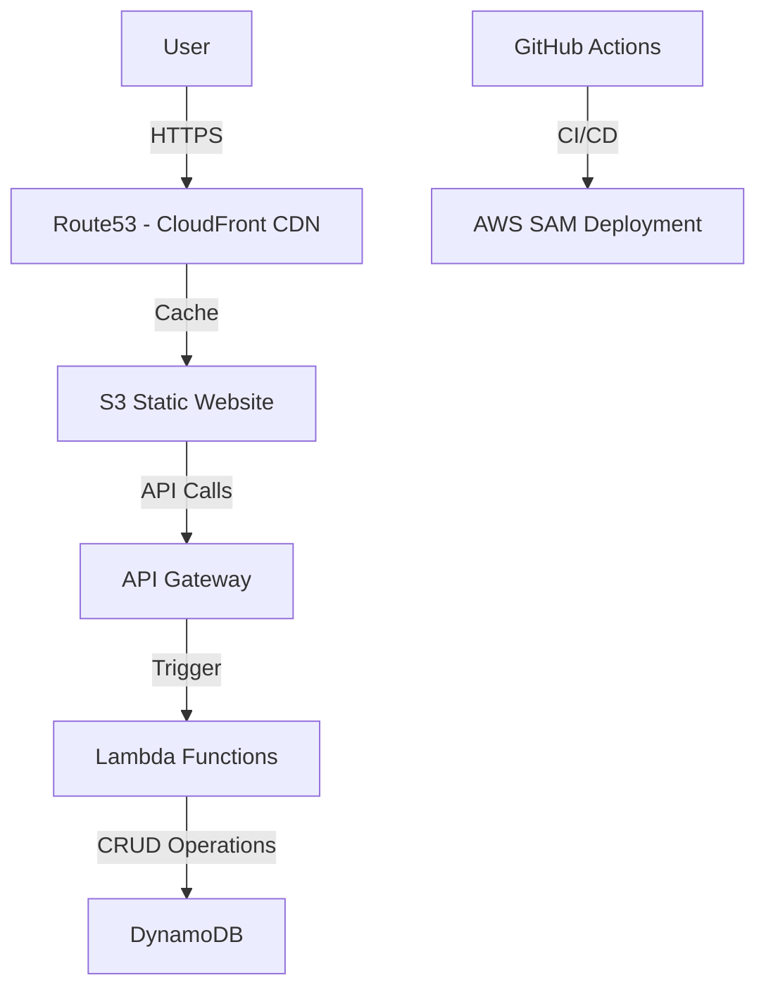
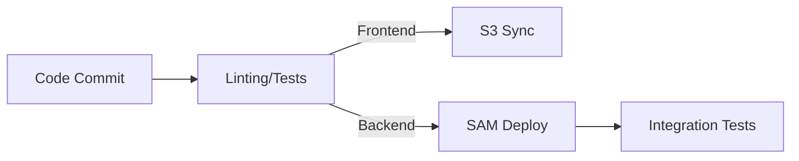

# Cloud Resume Challenge: A Serverless Journey 🚀

**Live Demo**: [https://ivan-bravo.com](https://ivan-bravo.com)

**Blog Post**: [Coming Soon](#)

## 📖 Project Overview
This repository documents my hands-on journey through the [Cloud Resume Challenge](https://cloudresumechallenge.dev/), implementing a serverless resume website while mastering modern cloud engineering practices. The project focuses on bridging theory with real-world implementation across frontend, backend, and DevOps domains.

## 🏗 Architecture Deep Dive

### Frontend

-   **Tech Stack**: HTML/CSS/JavaScript hosted on S3 with CloudFront distribution

-   **Challenge Insights**:

    -   Learned S3 website hosting limitations vs production requirements

    -   Implemented cache invalidation strategies for static content updates

    -   Struggled with CORS configuration between S3 and API Gateway

### Backend

-   **Serverless Stack**: API Gateway + Lambda + DynamoDB

-   **Key Features**:

    -   Visitor counter with atomic updates using DynamoDB `UpdateItem`

    -   JWT-based authentication prototype (future enhancement)

    -   Cost-optimized through Lambda cold start mitigation

### DevOps Pipeline

-   **CI/CD**: GitHub Actions with parallel workflows

-   **Testing Strategy**:

    -   Unit tests for Lambda functions (Jest)

    -   Integration tests for API endpoints

    -   Static analysis with ESLint and cfn-lint

🚀 Implementation Progress
--------------------------

| Component | Status | Notes |
| --- | --- | --- |
| Static Website | ✅ Done | Tailwind design, mobile-responsive |
| HTTPS/DNS Setup | ✅ Done | Route53 + ACM certificate configuration |
| Backend API | ✅ Done | Serverless framework deployed |
| Visitor Counter | ✅ Done | Atomic updates in DynamoDB |
| CI/CD Pipeline | 🛠 In Progress | GitHub Actions automation |
| Blog Post | ⏳ Planned | Drafting Medium article |

💡 Lessons Learned
------------------

1.  **Cloud Reality Check**:

    -   "Tutorials make it look easy - actual AWS error messages required deep documentation diving"

    -   Integrating all services requires an actual understanding of their uses. 

2.  **Serverless Tradeoffs**:

    -   Cold starts vs cost optimization balance

    -   Stateless architecture patterns

📚 Resources That Helped
------------------------

-   AWS Documentation

-   SAM CLI documentation

-   Cloud Resume Challenge book

-   Deepseek

🔜 Next Steps
-------------

-   Implement Canary deployments for backend

-   Add Terraform multi-cloud experiment

-   Build performance monitoring with CloudWatch Metrics

-   Write detailed blog post about the process

* * * * *
